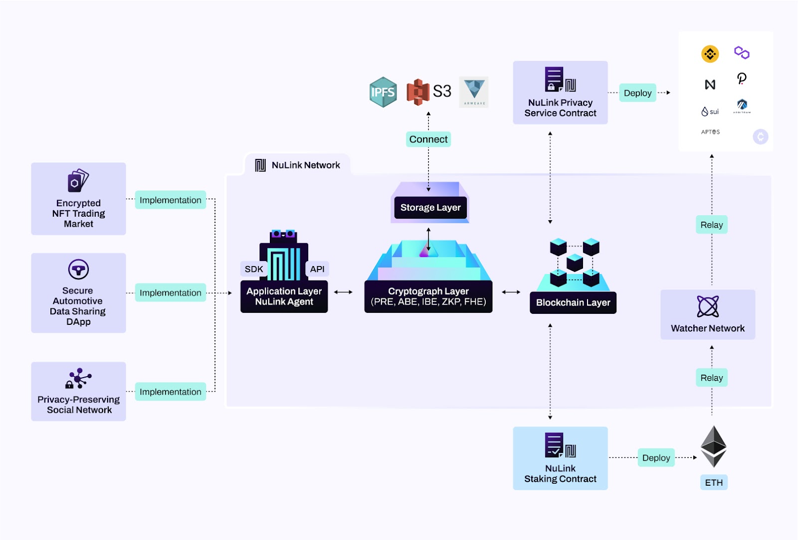

# Introduction

NuLink network is a decentralized solution for privacy-preserving application developers to implement the best practices and best-of-breed security and privacy. The NuLink network provides endpoint encryption and cryptographic access control. Sensitive user data can be securely shared from any user platform to cloud or decentralized storage and access to that data is granted automatically by policy in either Proxy Re-Encryption or Attribute-Based Encryption. For the data user on the other side, Zero-Knowledge Proof can help them verify the data source. In more advanced privacy-preserving use cases, NuLink uses Fully Homomorphic Encryption to customize enterprise-level data computation services.

The Nulink technology platform consists of blockchain, access control (Proxy Re-Encryption, Attribute-Based Encryption) and secure computation (Zero-Knowledge Proof, Secure Multi-party Computation, Fully Homomorphic Encryption) as its technical core. It provides enterprise-level data sharing and computation services.

## Solution

### Data Availability

At our core, we are committed to safeguarding data privacy. One of our primary objectives is to address the issue of data availability, which is typically divided into two parts. Firstly, we strive to provide consumers with the means to ascertain that the seller has the required data before making a request. Secondly, we aim to establish a mechanism for verifying the authenticity of the data in its encrypted form.

Within the NuLink network, Zero-Knowledge Proof is used to ensure that all functional nodes, including storage nodes, computing nodes, and proxy nodes, have publicly verifiable data processing and computing operations. At the same time, prior to authorizing data access, the data owner is required to present a Zero-Knowledge Proof. This proof verifies that the encrypted data is aligned with its plaintext counterpart, irrespective of the encryption scheme being used. This approach endows NuLink network with enhanced flexibility.

### Data Sharing

An additional challenge we need to address is how to maintain data security during transmission to other parties. Specifically, we must ensure that data remains uncompromised during transmission, and that it is only accessible to authorized individuals approved by the data owner.

NuLink addresses this challenge by leveraging proxy re-encryption, identity-based encryption, and attribute-based encryption. Initially, data is encrypted at the user-end, and access to the data is granted to authorized parties using the PRE, IBE, or ABE algorithms. Receivers can then decrypt the data using their private key as appropriate. Throughout this process, only the data owner and authorized parties can access the original data, ensuring its confidentiality and security.

### Data Computing

The last issue we are trying to address is privacy concerns related to data computation. In certain scenarios involving edge computing or machine learning, the individual who owns the data may only wish to grant access for computing purposes on a specific model. As a result, the authorized party would only receive the computed result and not the original dataset. 

NuLink will utilize FHE technology to enable privacy-preserving data computation. This approach leverages the unique property of Fully Homomorphic Encryption, which enables calculations to be performed on ciphertext. Initially, the dataset will be encrypted and transmitted to the computing providers. The computing providers will then execute the desired computation, such as a prediction model for machine learning. Ultimately, the encrypted result will be returned to the authorized party for decryption.

## Architecture

The NuLink network integrates the Application Layer, the Cryptography Layer, the Storage Layer, the Blockchain Layer and the Watcher Network.

1. The Application Layer: The Application Layer acts as an interface between the system and the application, facilitating direct communication with the application while also liaising with the Cryptography Layer to validate access to the application's confidential information.
2. The Cryptograph Layer: The Cryptography Layer carries out cryptographic functions for the Application Layer, such as generating keys, encrypting, decrypting, and other related tasks. It also connects to the Storage Layer to facilitate the uploading and downloading of encrypted privacy data.
3. The Storage Layer: Our platform's Storage Layer is a secure network created for the purpose of storing confidential data in encrypted form. At present, we utilize IPFS (InterPlanetary File System) as the primary decentralized storage network. Nonetheless, we intend to incorporate additional storage networks like S3 in the coming times.
4. The Blockchain Layer: The Blockchain Layer is responsible for managing staking node registration and service requests within the blockchain system. As of now, only Ethereum is supported for staking node registration. Nevertheless, users can still make service requests in other blockchain systems, such as Binance Smart Chain, Polygon, Polkadot, Arbitrum, Aptos or Sui.
5. The Watcher Network: The Watcher Network is a relayer network that transfers staking node information from Ethereum to other blockchain systems. To ensure its decentralization and security, the Watcher Network is maintained under an on-chain governance mechanism (DAO).
