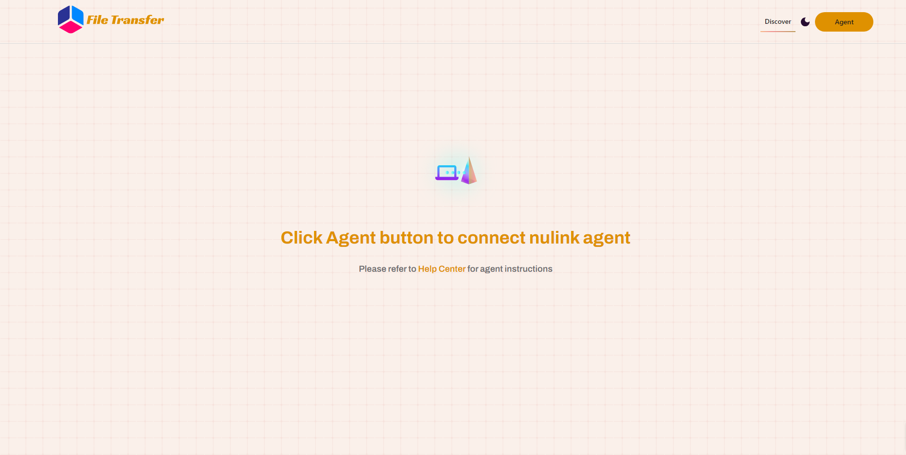
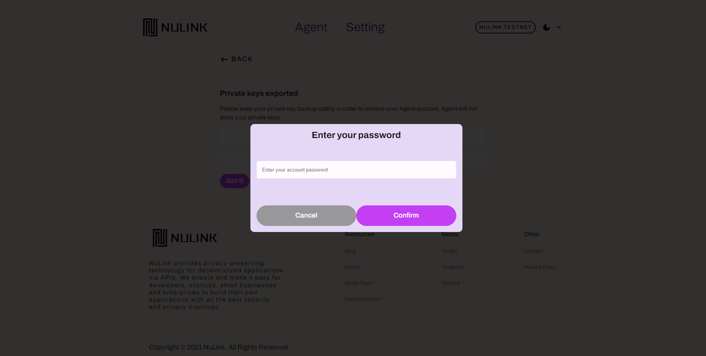
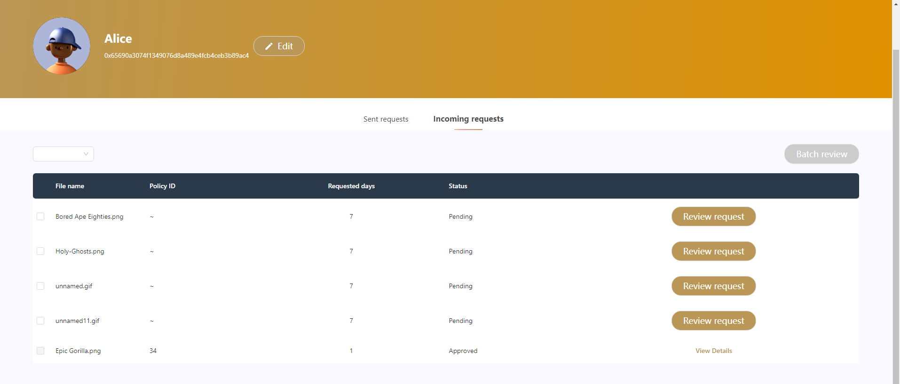

# NuLink Agent Use Case
We provide a third-party demo example, a private file-sharing platform called [File Transfer](https://agent-integration-demo.nulink.org). 
The business process is as follows: users can freely upload and encrypt their own files on the platform, and other users can apply for the files they are interested in. Once the author approves the application, the applicant can download and view the encrypted file. Due to the privacy and security considerations of the files, all operations of this platform must be conducted through on-chain contracts. Next, we will focus on introducing the business scenario of the application and Agent integration.

This application must be authorized to log in to the Agent account to access and operate normally. Click "Agent" in the upper right corner to call up the Agnet authorization page.

## Agent Authorization Login

Before formal authorization, you need to enter the account password and then click "confirm" to start the authorization.

As shown in the figure below, the authorization page will display the address of the request source and my Agent account address. 
Click "Confirm," and the page will automatically jump back to the third-party application page.

The figure below shows the File Transfer page of the third-party application, and it is logged in with the Agent's current account. If you have not uploaded any files, please click "Upload file" to upload files first.

## File Application

The figure below shows the file details page, and clicking "Request the file" can apply for the file. Enter the number of days you want to apply for and click "Submit."

Next, the Agent will be called up for file application authorization, which includes the relevant information of the file: file name, owner address, requester address, source URL, and requested days. Click "Confirm" to authorize.

After the authorization is completed, the page will jump back to the third-party application page, and the file status will change to "pending."

## File Approval

The figure below shows the list of applications received by the author, and clicking the "Review request" button can view the application details.

After reviewing the application details, click "Submit."

At this time, the Agent authorization page will be called up, where you can see the relevant information of the application: the addresses of both parties, the source URL, the calling method, the gas fee, and the service fee. Click "Confirm" to complete the payment and approval.

After the approval is completed, the page will jump back to the third-party application page, and the file status will change to "Approved."

