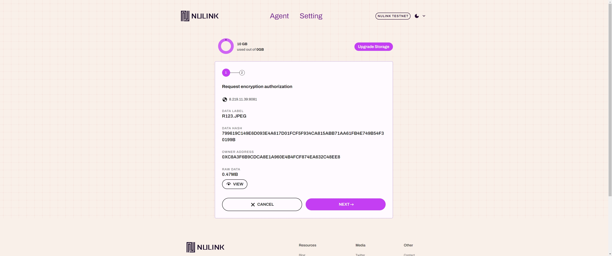
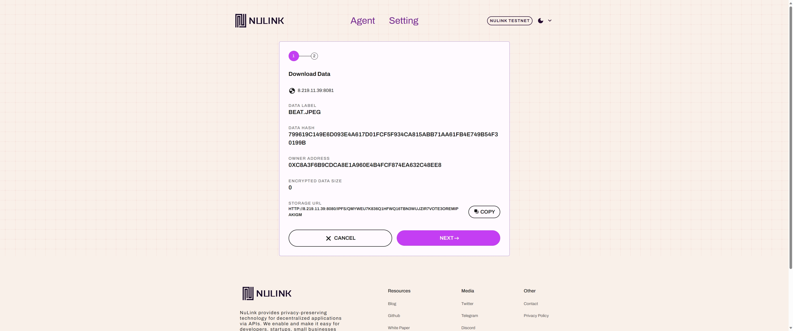

# NuLink Agent SDK
The SDK for third-party integration with [NuLink Agent](../product/nulink_agent.md).

``` nulink web agent access sdk ```is a complete library to interact with the NuLink blockchain. You can use it in the browser, or in Node.js runtime.
These APIs allow you to access Nulink Web Agent programmatically and perform various actions, such as connect, upload data, apply, approve and download.

## Supported

### Networks

| Network | Chain ID |
|--------|----------|
| Horus (BSC Testnet) | 97       |
| Conflux eSpace Testnet | 71       |

### NuLink Agent

TestNet:https://agent.testnet.nulink.org

## Getting Started

The default address in the Nulink Web Agent Access SDK:

* NuLink Agent: https://agent.testnet.nulink.org
* Backend service address: https://agent-integration-demo.nulink.org/bk
* NuLink Staking Service Address: https://staking-api.testnet.nulink.org
* NuLink Porter Service Address: https://porter-api.testnet.nulink.org

The default network is Horus (BSC Testnet), default chain id is 97.
If you need to change these addresses and network, you will need to write the following configurations in the .env file of your project:
- REACT_APP_NULINK_AGENT_URL:  the web agent address
- REACT_APP_CENTRALIZED_SERVER_URL: the centralized service address
- REACT_APP_STAKING_SERVICE_URL: the staking service address
- REACT_APP_BSC_TESTNET_PORTER_URL: the porter service address
- REACT_APP_DEFAULT_NETWORK_CHAIN_ID: the network chain id

```
// modify .env in your project
// web agent address
REACT_APP_NULINK_AGENT_URL=xxxxxx
// agent centralized bcakend service address
REACT_APP_CENTRALIZED_SERVER_URL=xxxxxx
// staking service address
REACT_APP_STAKING_SERVICE_URL=https://staking-api.testnet.nulink.org
// porter service address
REACT_APP_BSC_TESTNET_PORTER_URL=https://porter-api.testnet.nulink.org
// chain Id
REACT_APP_DEFAULT_NETWORK_CHAIN_ID=xx
```

## Install
```bash
npm i @nulink_network/nulink-web-agent-access-sdk
```
or
```bash
yarn add @nulink_network/nulink-web-agent-access-sdk
```
## How to use

- [Interacting with NuLink Agent](#interacting-with-nulink-agent)
- [Upload data](#upload-data)
- [Apply Data](#apply-data)
- [Approve the apply data as publisher](#approve-the-apply-data-as-publisher)
- [Download data](#download-data)

### Interacting with NuLink Agent

The most common action is Sign In, where the user is redirected to the Wallet page to authorize the application.
Once the user has successfully signed in, an access key is stored in the browser's LocalStorage.
Subsequent actions that require the access key will be permitted.

```typescript
    import { connect } from "@nulink_network/nulink-web-agent-access-sdk"

    const gotoConnect = async () => {
        await connect(loginSuccessHandler)
    }
    
    const loginSuccessHandler: CallBackFunc = async (responseData) => {
        if (responseData) {
            // Do something with the responseData
            console.log(responseData);
        } else {
            // Handle the error case
            console.error('Failed to login in');
        }
    }
```
When the connect interface is called, the browser will be redirected to NuLink Agent, where user authentication is performed on the Agent side.
Once the authentication is completed, the agent-access-sdk will store the user information in the LocalStorage of the calling side,
indicating that the login process has been completed.

### Upload data

There are four interfaces available for uploading data as publisher: uploadData, uploadDataBatch, uploadFile, and uploadFileBatch.
By calling these upload interfaces, you can navigate to the Agent upload page to complete the upload. After the upload is completed,
you will receive the dataLabel and dataHash of the uploaded data.

```typescript
import { uploadData } from "@nulink_network/nulink-web-agent-access-sdk"

const _uploadAction = async () => {
    await uploadData({ dataLabel : dataLabel, fileBinaryArrayBuffer: blob }, async (responseData) => {
      if (responseData) {
        // Do something with the responseData
        console.log(responseData.dataInfo);
      } else {
        // Handle the error case
        console.error('Failed to upload');
      }
    })
}
```

```typescript
import { uploadDataBatch } from "@nulink_network/nulink-web-agent-access-sdk"

const _uploadAction = async () => {
    await uploadDataBatch(dataList, async (responseData) => {
      if (responseData) {
        // Do something with the responseData
        console.log(responseData.dataInfo);
      } else {
        // Handle the error case
        console.error('Failed to upload');
      }
    })
}
```

```typescript
import { uploadFile } from "@nulink_network/nulink-web-agent-access-sdk"

const _uploadAction = async () => {
    await uploadFile( file, async (responseData) => {
      if (responseData) {
        // Do something with the responseData
        console.log(responseData.dataInfo);
      } else {
        // Handle the error case
        console.error('Failed to upload');
      }
    })
}
```

```typescript
import { uploadFileBatch } from "@nulink_network/nulink-web-agent-access-sdk"

const _uploadAction = async () => {
    await uploadFileBatch( files, async (responseData) => {
      if (responseData) {
        // Do something with the responseData
        console.log(responseData.dataInfo);
      } else {
        // Handle the error case
        console.error('Failed to upload');
      }
    })
}
```


By calling the ``` getFileList ``` API, you can retrieve all the uploaded data within the Agent.

### Apply Data

When applying for data, you can use the apply method from the Agent SDK to pass the file information to NuLink Agent.
This will open the application page of NuLink Agent where you can complete the application process.
The file information can be obtained from the ``` getFileList ``` and ``` getFileDetail``` API.

```typescript
import { apply } from "@nulink_network/nulink-web-agent-access-sdk"

const applyForFile = async () => {
  await apply(_dataName, _dataId, _dataCreatorAddress, _dataUrl, _dataHash, _zkProof, _usageDays, async () => {
    if (responseData) {
      // Do something with the responseData
      console.log(responseData);
    } else {
      // Handle the error case
      console.error('Failed to upload');
    }
  });
};
```

You can retrieve the data that the user has applied for by using the ``` getSendApplyFiles``` function
In the response data of ``` getSendApplyFiles```, the value of the "status" field indicates the approval status of the data,
where 1 represents "applying" 2 represents "approved" and 3 represents "rejected"

### Approve the apply data as publisher

By calling the ``` getIncomingApplyFiles``` function, you can retrieve all the incoming apply data of the user


calling the ``` approve ``` function, you can pass the data that needs to be approved to NuLink Agent.
The data information can be obtained from the ``` getIncomingApplyFiles ``` API.
The number of backup nodes required for the ```approve ``` method can be obtained by calling the ```getUrsulaNumber ``` API


In the response data of ``` getIncomingApplyFiles```, the value of the "status" field indicates the approval status of the data,
where 1 represents "applying" 2 represents "approved" and 3 represents "rejected"

### Download data

Once the data requested by the user is approved, it can be downloaded

calling the ```download``` function, you can pass the information for downloading the data to NuLink Agent. The ``` download``` function will return the binary buffer of the downloaded data
#### Example

```typescript
import { download }  from "@nulink_network/nulink-web-agent-access-sdk"

const fileDownload = async () => {
    await download(
        detailItem.file_id,
        detailItem.file_name,
        detailItem.file_hash,
        detailItem.creator_address,
        detailItem.file_zk_poof,
        detailItem.file_url,
        detailItem.file_encrypted_size,
        fileDownloadCallBack,
    );
};

const fileDownloadCallBack = async (data) => {
    try {
        if (!!data && data.arrayBuffer) {
            const blob = new Blob([data.arrayBuffer], { type: 'arraybuffer' })
            const url = window.URL.createObjectURL(blob)
            const link = document.createElement("a");
            link.style.display = "none";
            link.href = url
            link.setAttribute("download", data.fileName);
            document.body.appendChild(link);
            link.click();
            document.body.removeChild(link);
        }
    }catch (error){
        throw new Error("Decryption failed, Please try again")
    }
}
```


## Utilities

The default network for the NuLink Agent SDK is Horus (BSC Testnet), with a chain ID of 97

``` getNetWorkChainId``` function can be used to retrieve information about the current network.
``` setNetWorkChainId``` function can be used to change current network.


See [nulink-web-agent-integration-demo](https://github.com/NuLink-network/nulink-web-agent-integration-demo.git)  to get how to use NuLink Agent SDK.

Here the [Agent SDK API reference](./agent_api.md).
