# NuLink File Sharing Dapp  

## Overview  
NuLink File Sharing Dapp is the entrypoint for data sharing users to manage the private file and handle the authorization request. Access NuLink File Sharing Dapp [here](https://filetransfer.nulink.org/).  

## Initialization: Connect Agent and Log in  
Before using NuLink File Sharing Dapp, please click agent button to connect NuLink-agent. 
How to register and use NuLink-agent please refer to [this link](https://docs.nulink.org/products/nulink_agent).  

 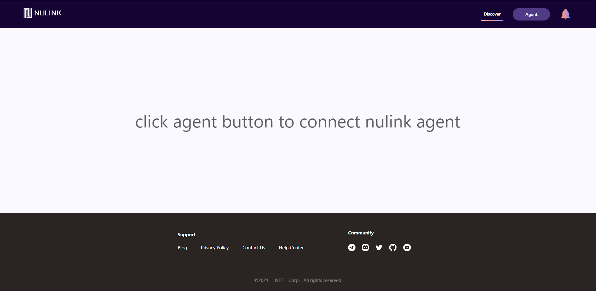  

After connecting, user can access the NuLink File Sharing Dapp. It includes five pages: Discover page, Faucet page, Ranking page, User Center page and Notification page.  

## Discover Page  
Click on the discover button to access discover page. In this page, user can view and search the file uploaded in the NuLink network.   

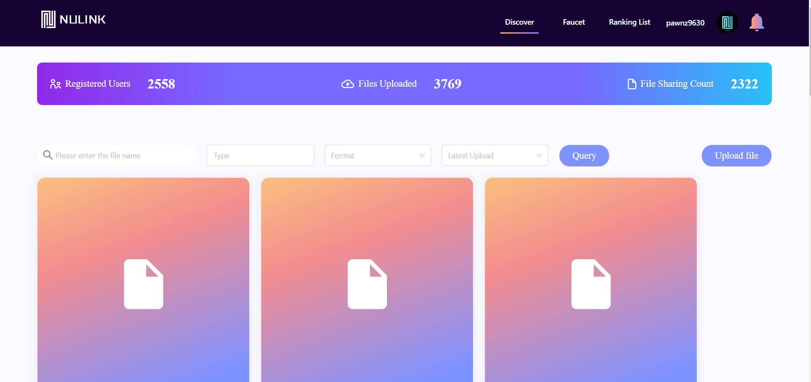  

Discover page supports following functions: Choose some tags such us “Philosophy”, “Image” to filter the files; Search or fuzzy search by filename or partial filename; Sort files by upload time (from newest to oldest/ from oldest to newest).  

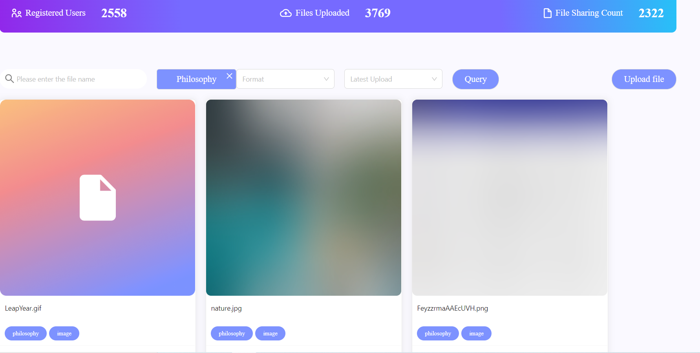  

Each file displays the file name, owner information and mosaic plot. Click it to view more detail. File detail page displays various information including the following: Image, File name, Data owner’s avatar and nickname, IPFS file address.   

  

Send an application to the file owner by clicking “Request this file”.
After clicking the button, a pop-up window will appear, enter the number of days requested and click "submit" to successfully submit the request.  

  

If the file owner has not approved the application, the applicant will always display the "pending" status when entering the details page again:  

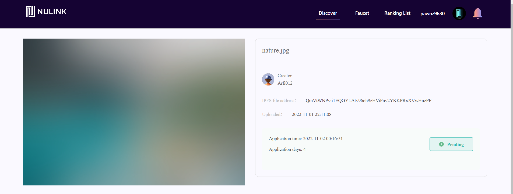  

After the data owner has completed approval, the applicant can then go to this detail page and download the file:  

  

## Faucet Page  
Click the faucet button to claim tNLK and tBNB for later use. Each account can claim tNLK only once. Simply copy your address in the agent to claim the tNLK. And use the link to claim tBNB in bsc-testnet faucet. 

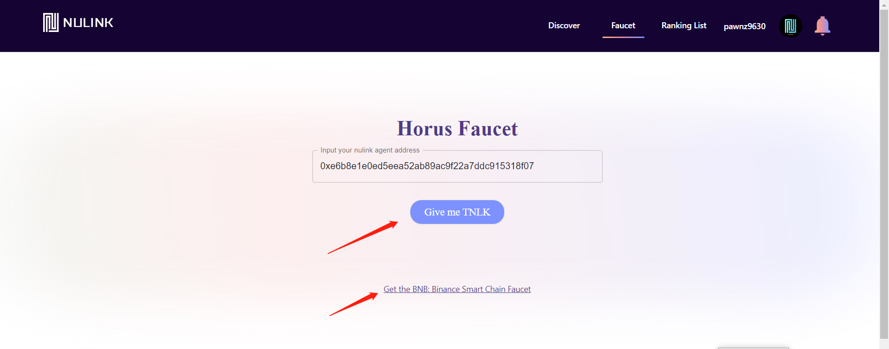   

## Ranking Page  
Click the ranking-list button to check the current ranking of the file-sharing contest.   

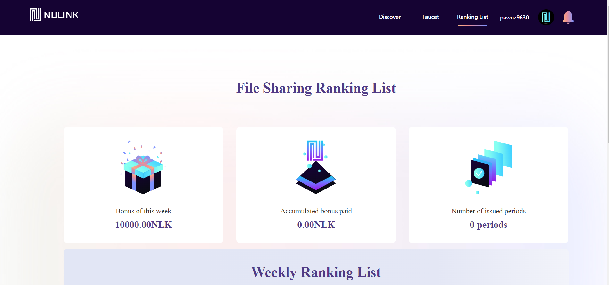  

## User Center Page  
Click on name/avatar thumbnail button to access user center page. In this page, user can view personal information, including Avatar Thumbnails, Nickname, Wallet Address and Personal Profile. User center page will also display “My files”, “Sent requests”, “Incoming requests” and “My vault”.  

  

Click on “edit” button to edit personal information. Fill or change Nickname, User site, Twitter/Instagram/Facebook and Personal profile.  Click to call the local file path and select the image to replace Avatar Thumbnails. Save changes by clicking the “Save” button.  

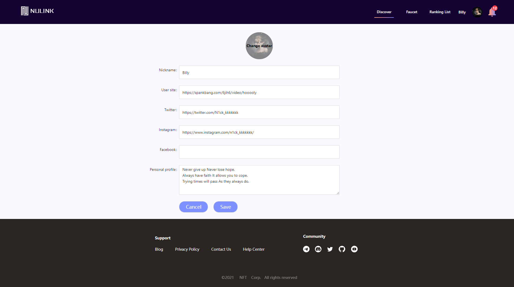  

### My Files
My files page lists all the files that user has uploaded, with file display information including thumbnails, file names, username and avatar.  

  

### Sent Requests
The Sent requests page lists all the requests that user has sent. Check the status of each request on this page. Status includes Approved, Pending, Rejected. User can filter requests based on these statuses.   

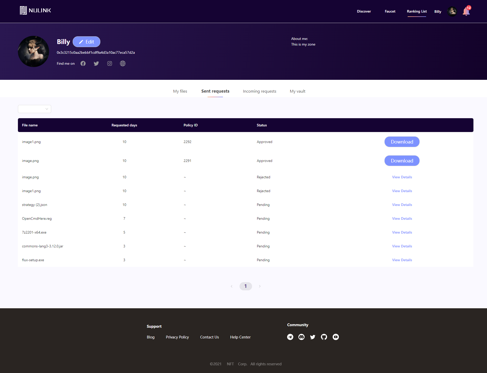  

Click "View Details" to view more information about the requests.  

  

For files with Approved status, click "Download" button to download them to the local.  

### Incoming Requests
The Incoming requests page lists all the requests that user has received. View the status of each request and deal with them on this page. Status also includes Approved, Pending, Rejected.   

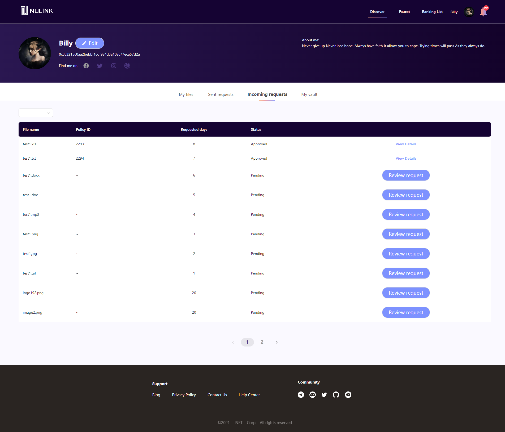  

For requests in the Approved or Rejected status, click "View Details" button to see the details including File name, Owner address, Policy id, Request time, Expiration time and Status.  

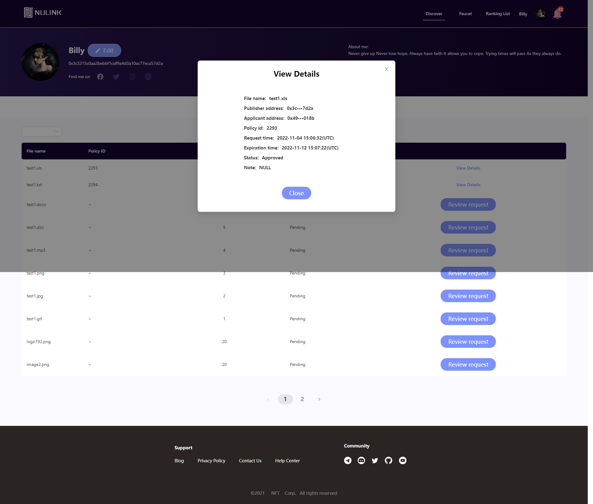  

For files which under Pending status needs the operation of "Review request". After clicking on the approval opinion, choose "Yes" to agree with the request or "No" to reject. If user choose "Yes", then it will appear a pop-up window to call [NuLink-agent](https://docs.nulink.org/products/nulink_agent)  to pay the gas fee.  After successful payment, the request will be approved, as shown in the figure below：  

  

### My vault
My vault page mainly shows the information of the user's associated policies, and there are two roles to view the policies:   
The first role is as publisher: As the role of creating and uploading files, when publisher pass the request of other users, a policy id will be generated, "As Publisher" page will display the associated files and corresponding policy id that have been authorized out successfully.  

  

Click "View Files" to access files and view more information.  

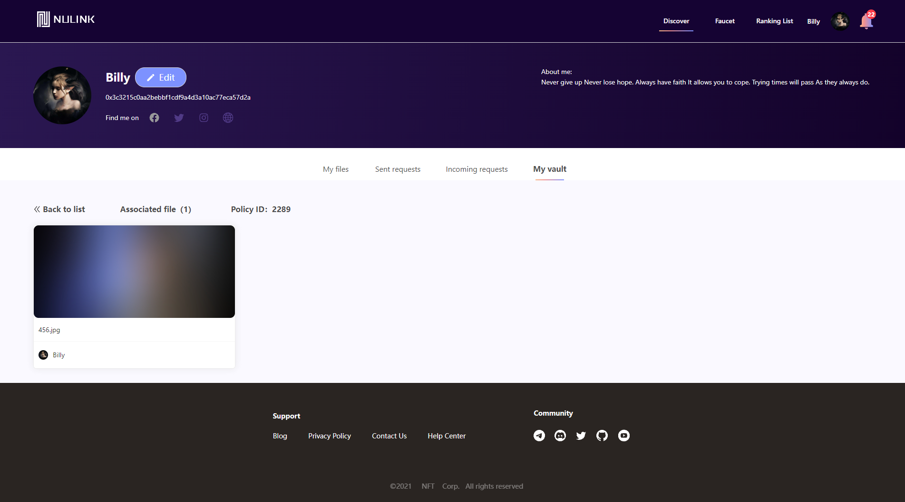  

The second role is as applicant: As the requester of the file, when applicant request is approved, a corresponding policy ID will be generated. View all the requested files on As Applicant page, including the file name, policy id and publisher address, and download all these files to the local without repeating the request by clicking “View file” button.  

  

Click "View Files" to access files and view more information.  

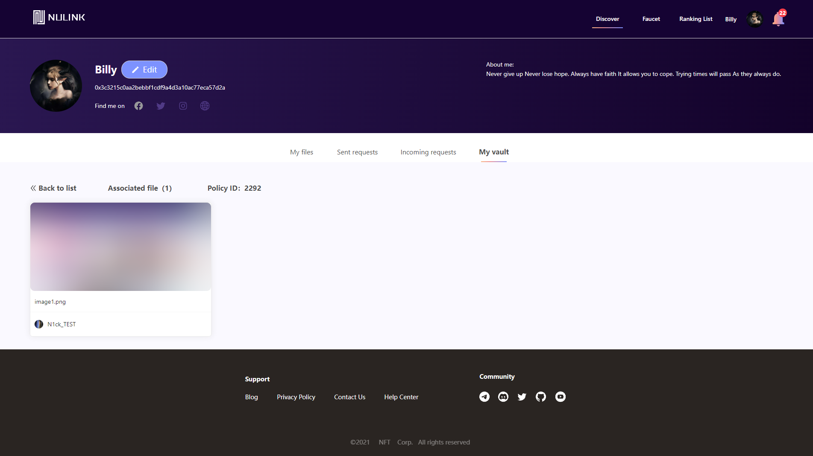  

## Notification Page

Click the bell pattern in the upper right corner to enter the notification page. This page displays all the system messages that user has received. Click on the view details button for further processing of these messages.   

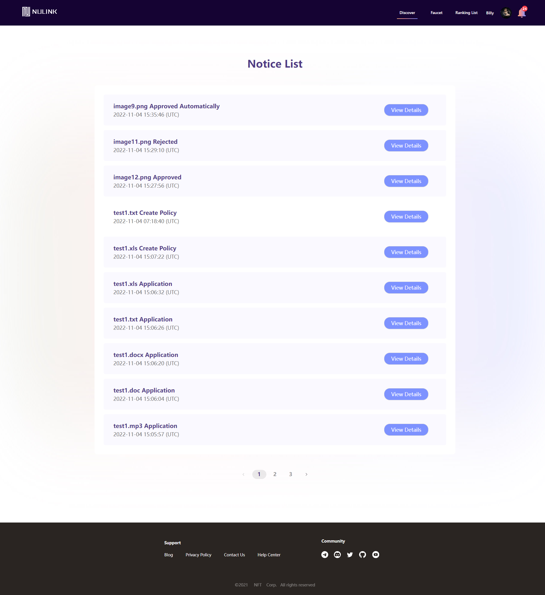  

There are mainly five types of notices: Application, Create Policy, Rejected, Approved and Approved Automatically: Application means user has received a applicant; Create Policy means the policy was successfully created; Rejected/Approved means user application was rejected/approved by the data owner; Approved Automatically means user have applied again for the file corresponding to the approved policy, and the system will automatically approve it.   